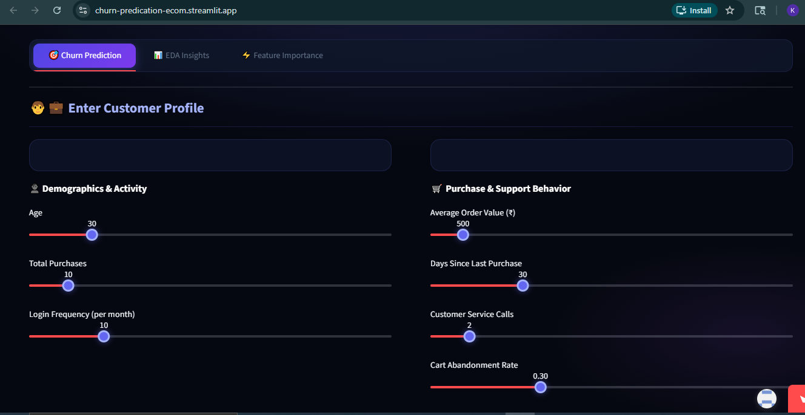

# 🔮 ChurnIQ — Customer Churn Intelligence Dashboard

> **Predict risk. Understand behavior. Retain customers.**

---

## 📌 Project Overview

ChurnIQ is an end-to-end **customer churn prediction system** built on 50,000 e-commerce customer records. It identifies which customers are at risk of churning and surfaces the behavioral signals behind that risk — enabling data-driven retention strategies.

The project covers the full data analyst workflow:

- Data cleaning & feature engineering
- Exploratory data analysis (EDA)
- Model training, comparison & evaluation
- Business interpretation & recommendations
- Interactive Streamlit dashboard for real-time prediction

---

## 🚀 Live Demo

👉 **[churn-predication-ecom.streamlit.app](https://churn-predication-ecom.streamlit.app)**

The dashboard has three tabs:

| Tab | Description |
|---|---|
| 🎯 Churn Prediction | Enter a customer profile and get a real-time churn risk score |
| 📊 EDA Insights | Visualize patterns across the dataset |
| ⚡ Feature Importance | See which features drive churn the most |

---

## 📸 Screenshots

### Churn Prediction Tab

### Prediction Result

### Feature Importance

---

## 📂 Project Structure
